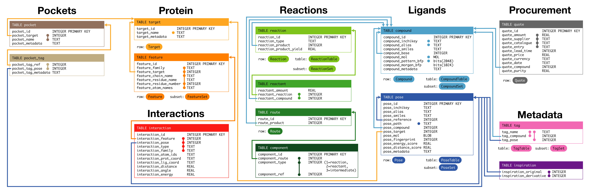

Database
=========

HIPPO stores data using Django ORM models backed by PostgreSQL (with the RDKit cartridge for chemistry-aware queries) or SQLite for local development.

.. automodule:: designdb.models
    :members:
