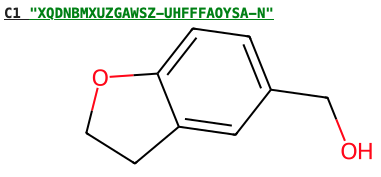
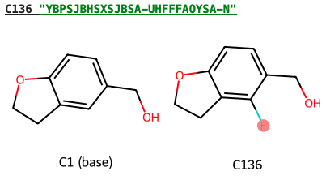
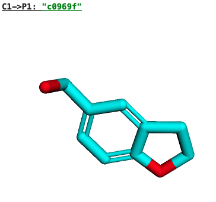

=====================
Definitions and units
=====================

Definitions
===========

HIPPO uses an sqlite database with several inter-connected tables (see :doc:`db`). In both the database and the python API the following core objects are defined:

Target
------

A :class:`.Target` represents a certain protein / XCA-alignment as uploaded to Fragalysis.

Compound
--------

A :class:`.Compound` represents a ligand/small molecule with stereochemistry removed and no atomic coordinates. I.e. it represents the flattened chemical structure. It's default name is always an InChiKey. :class:`.Compound` objects can have an :attr:`.Compound.alias` which is a custom name which will supercede the InChiKey when representing the compound. :class:`.Compound` objects also have a shorthand prefixed with ``C``, for example: ``C1`` which refers to the compound with database id 7273.

:: 

	c1 = animal.register_compound(smiles="OCc1ccc2c(c1)CCO2")
	print(c1)
	c1.draw()

.. seealso::
	:doc:`compounds` API reference page

Scaffolds / Elaborations
~~~~~~~~~~~~~~~~~~~~~~~~

Scaffold / superstructure relationships can also be encoded for :class:`.Compound` objects. Namely, the :attr:`.Compound.scaffolds` property can be used to access other :class:`.Compound` objects that have been labelled as scaffolds/substructures, and :attr:`.Compound.elabs` is used to access the inverse relationship.

:: 

	c2 = animal.register_compound(smiles="OCc1ccc2c(c1F)CCO2")
	c2.add_scaffold(scaffold=c1)
	print(c2)
	c2.draw()

Ingredient
----------

An :class:`.Ingredient` is defined as a specific quantity (in ``mg``) of a :class:`.Compound` and is used when defining quotes and recipes.

Pose
----

A :class:`.Pose` is a particular conformer of a :class:`.Compound` within a protein environment. A pose will have its own (stereochemical) smiles string, and must have a path to a coordinate file. This file can either be a ``.mol`` molecule file or a ``.pdb`` file of the protein-ligand complex.

:: 

	p1 = c1.poses[0]
	print(p1)
	p1.draw()

.. seealso::
	:doc:`poses` API reference page

Reference
~~~~~~~~~

When a pose has been defined from a ``.mol`` file without a protein conformation, a :attr:`.Pose.reference` can be set to use the protein conformation from a different pose.

Inspirations
~~~~~~~~~~~~

Poses can have :attr:`.Pose.inspirations` that can be used to link to other poses that have been referenced in the design of this pose, for example it can be used to link to experimental fragment hits referenced in the fragment-growing/merging compound design.

Tag
---

:class:`.Compound` and :class:`.Pose` objects can be tagged with arbitrary :class:`.Tag` strings to categorise them.

Quote
-----

Procurement and catalogue/inventory availability information for :class:`.Compound` entries can be added to the database and interfaced with :class:`.Quote` objects.

.. seealso::
	:doc:`quoting` API reference page

Reaction
--------

A :class:`.Reaction` is a simplified representation of a chemical reaction from the :attr:`.Reaction.reactants` (:class:`.CompoundSet`) to a single :attr:`.Reaction.product` (:class:`.Compound`).

.. seealso::
	:doc:`reactions` API reference page

Recipe
------

A :class:`.Recipe` describes a synthetic pathway, potentially containing multiple :class:`.Reaction` steps to any number of :class:`.Compound` products (:attr:`Recipe.products`). Recipes are not stored in the database but can be serialized into ``JSON``.

.. seealso::
	:doc:`recipes` API reference page

Route
-----

A :class:`.Route` is a special case of the :class:`.Recipe` mechanism, with the distinction that it encodes the information needed to synthesise a single product :class:`.Compound`. Routes can be stored and retrieved from the database.

Subsite
-------

:class:`.Subsite` records are an additional annotation that can be applied to :class:`.Pose` entries, these should be used to indicate which subsites a pose occupies on a protein target.

Feature
-------

A :class:`.Feature` is a pharmacophoric feature on a given protein :class:`.Target`

.. seealso::
	:doc:`interactions` API reference page

Interaction
-----------

The :class:`.Interaction` class can be used to store protein-ligand interactions between pharmacophores on the ligand and :class:`.Feature` records.

.. seealso::
	:doc:`interactions` API reference page
	
Units
=====

- lead time: days
- compound quantities/amounts: mg
- purity: fraction [0,1]
- product_yield: fraction [0,1]
