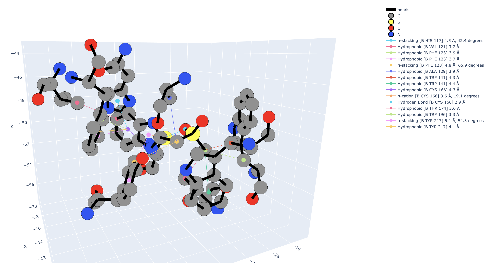

==========================
Getting started with HIPPO
==========================

To create a HIPPO database or interface with an existing one, create a :class:`.HIPPO` `'animal'` object:

::

	from hippo import HIPPO
	animal = HIPPO(project_name, "path/to/db.sqlite")

Loading crystallographic hits from Fragalysis
=============================================

1. Go `Fragalysis
<https://fragalysis.diamond.ac.uk>`_ and download a dataset. For public datasets you can use :func:`.fragalysis.download_target`

2. Load the crystallographic data

::

	animal.add_hits(
		target_name='A71EV2A',
		metadata_csv='/path/to/metadata.csv',
		aligned_directory='/path/to/aligned_files',
	)

.. attention::

	N.B. all poses loaded into a HIPPO database only have an absolute path stored to the original file - they are not copied! It is your responsibility to ensure that their original files remain accessible.

Navigating compounds and poses
==============================

The below sections explain how to work with :class:`.Compound` objects and sets thereof. For further details on the concept of :class:`.Compound` objects and others see :doc:`definitions`.

Getting compounds/poses
-----------------------

Compounds can be accessed via the compounds property which wraps a :class:`.CompoundTable`:

::

	all_compounds = animal.compounds

CompoundTables can be indexed using their database id (positive integer) or InChiKey (str):

::

	c1 = animal.compounds[1]
	c2 = animal.compounds["FHZALEJIENDROK-UHFFFAOYSA-N"]

You can select a subset of compounds using slices, tuples, or lists:

::

	subset1 = animal.compounds[20:30]
	subset2 = animal.compounds[1,2,3,4]
	subset3 = animal.compounds[[1,2,3,4,5]]

Additionally you can get compounds by their tag:

::
	
	hits = animal.compounds(tag='hits')

.. See also the :doc:`tools for structure-based searching<queries>`

Equivalent methods exist for animal.poses (returns a :class:`PoseTable`), animal.reactions (returns a :class:`.ReactionTable`), animal.interactions (returns a :class:`.InteractionTable`), and animal.tags returns a :class:`TagTable`). See also the :doc:`api_reference` pages. 

Inspecting a compound and its poses
-----------------------------------

Once you have a compound you can access database properties using its properties:

::

	c = animal.compounds[1]

	c.id # Database ID (int)
	c.name # InChiKey
	c.smiles # (flattened) smiles
	c.mol # rdkit.Chem.Mol
	c.tags # assigned tags
	c.metadata # metadata dictionary
	
	c.draw() # draw the molecule (and its base)

You can access a compounds poses, which have similar functionality

::

	poses = c.poses

	p = poses[0]

	p.id # Database ID (int)
	p.name # pose name
	p.smiles # (stereo) smiles
	p.mol # rdkit.Chem.Mol
	p.tags # assigned tags
	p.metadata # metadata dictionary
	
	c.draw() # draw the molecule pose (3d)

See also the API reference for :doc:`compounds <compounds>` and :doc:`poses <compounds>`.

Graphing
========

Several convenient graphing methods are available. Try:

::

	animal.plot_tag_statistics()
	animal.plot_pose_property('CanonSites')

Interaction fingerprinting
==========================

Interactions fingerprinted as follows:

::

	from tqdm import tqdm

	for pose in tqdm(animal.poses):
		pose.calculate_interactions()

*N.B. tqdm just gives you a nice progress bar*

Interaction fingerprints can be visualised with a 'punchcard', per-residue histogram, or viewed individually for a :class:`.Pose`.

Interaction Punchcard
---------------------

::

	animal.plot_interaction_punchcard(poses=animal.poses(tag='hits'), subtitle='hits', group='pose_name')

See also :func:`.plotting.plot_interaction_punchcard`.

Interactions by residue
-----------------------

::

	animal.plot_residue_interactions(poses=animal.poses(tag='hits'), residue_number=123, chain='A', subtitle='hits')

See also :func:`.plotting.plot_residue_interactions`.

Interactions of a single Pose
-----------------------------

This will create an HTML file you can open in your browser:

::

	import molparse as mp
	pose = animal.poses[1]
	fig = animal.plot_pose_interactions(pose=pose)
	mp.write(f'{pose}_interactions.html', fig)

This method of writing to an HTML file works for all the above figures.

See also :func:`.plotting.plot_pose_interactions`.

